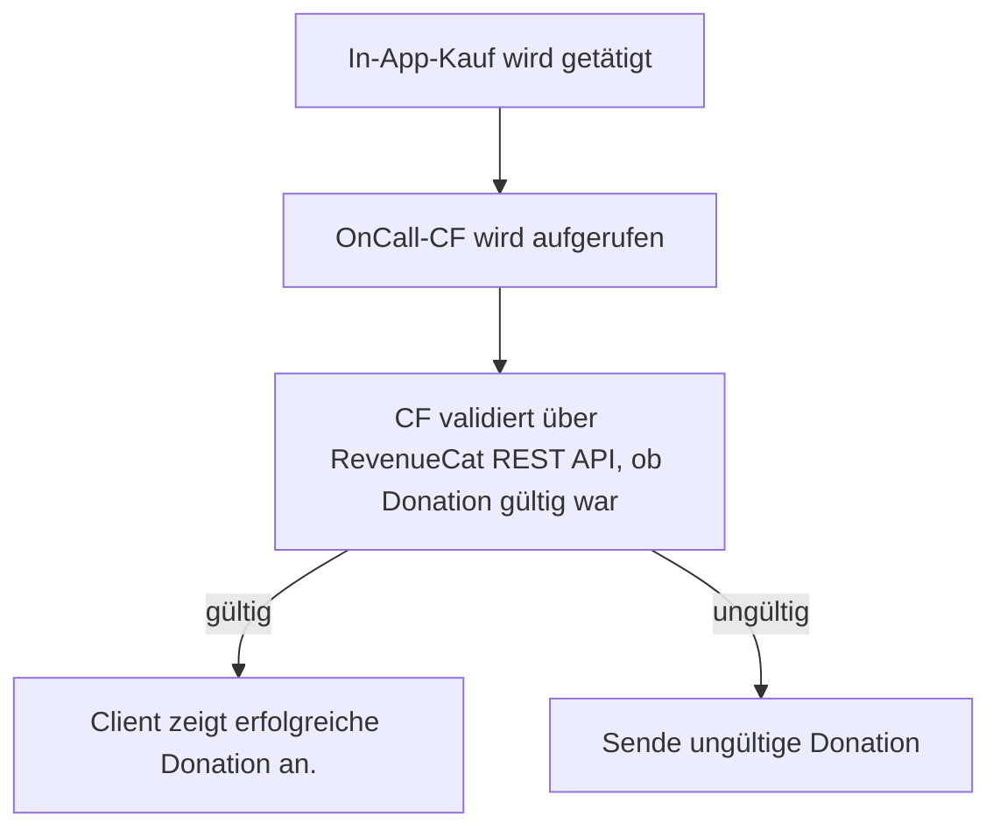

## Donation-Flow

```mermaid
graph TB

   InAppPurchase[In-App-Kauf wird getätigt]-->
   DonationDocument[OnCall-CF wird aufgerufen]-->
   Validation[CF validiert über RevenueCat REST API, ob Donation gültig war]
   Validation -- gültig --> Notification[Client zeigt erfolgreiche Donation an.]
   Validation -- ungültig --> DeleteDonation[Sende ungültige Donation]

```