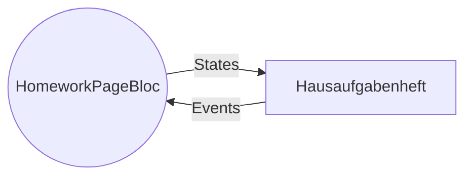
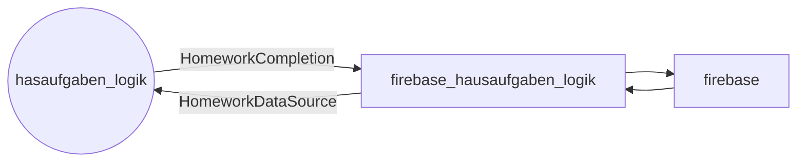

# hausaufgabenheft_logik-Package

Die Logik für das Hausaufgabenheft ohne Abhängigkeit von Flutter und Firestore.
Firestore wird mit firebase_hausaufgabenheft_logik-Package mit Flutter in main.dart eingebunden.
Die genauen Schnittstellen mit  der Außenwelt werden nachher beschrieben.  

 Hausaufgaben sind in dem Package von dem Rest der Infrastruktur getrennt,
 wie z.B. Speicherort und -Art der letztendlichen Hausaufgabe.

 Hier ist alles nur auf den Benutzer und auf die persönliche Informationen
 der zugehörigen Hausaufgaben zugeschnitten. Das heißt, dass hier eine
 Hausaufgabe nur einen simplen "gemacht" Status hat, der nur auf den einzelnen
 Nutzer zugeschnitten ist, unabhängig von der letztendlichen
 Speichertart/-struktur in der Datenbank.

## Libraries (`.dart`-Dateien, die von außerhalb des Packages benutzt werden können)

`hausaufgabenheft_logik.dart`  
Alle Klassen, die bei der normalen Benutzung des Blocs von außen benötigt werden. 
Dazu zählen z.B. die Views, das Interface vom `HomeworkPageBloc` + die zugehörigen `Events` und `States` (mehr dazu später) und die Klassen `HomeworkDataSource`/`HomeworkCompletionDispatcher`, die den Bloc an die "Außenwelt" (Datenbank, also bei uns Firestore) anschließbar machen.

`hausaufgabenheft_logik_setup.dart`    
Die Klassen, die nötig sind um den Bloc aufzusetzen, bei uns in `main.dart`  
Beispielcode:   

```dart
    final config = HausaufgabenheftConfig(
        defaultCourseColorValue: Colors.lightBlue.value,
        nrOfInitialCompletedHomeworksToLoad: 8);
    ///Die Klassen von firebase_hausaufgabenheft_logik, die die Logik an Firebase anbinden.
    final dependencies = HausaufgabenheftDependencies(
        firestoreHomeworkRepository,
        _homeworkCompletionDispatcher,
        firestoreHomeworkRepository.getCurrentOpenOverdueHomeworkIds);
    final homeworkPageBloc = createHomeworkPageBloc(dependencies, config);
```

## Implementation via Bloc-Package

Um die Blocs zu implementieren wurde das [`Bloc`-Package](https://pub.dev/packages/bloc) benutzt.  
Das `Bloc`-Package ermöglicht es sehr einfach Logging einzuführen, was in Zukunft sehr hilfreich ist.  
Der `Bloc` funktioniert generell nur über `Event` und `State`-Klassen.  
Ein `Event` für den `HomeworkPageBloc` ist beispielsweise `CompletedAllOverdue`, welches dem Bloc sagt alle überfälligen Hausaufgaben abzuhaken. Die States sind bei dem Bloc `Loading` und `Success`, wobei bei `Success` die Views für die Seite übergeben werden.  	
Mit einem einfachen Interface kann dann für alle `Blocs` aus dem `Bloc`-Package direkt Logging für alle einkommenden Events und ausgehenden States eingeführt werden, was ganz cool ist.



## Anbindung an die Außenwelt

Da die Hausaufgaben-Details momentan noch nicht über das Package bearbeitet werden, ist die einzige Aktion an Firebase das Abhaken einer Hausaufgabe. 
Eine Hausaufgabe wird über den `HomeworkCompletionDispatcher` abgehakt,
welcher eine abstrakte Klasse ist, die dadurch an jeden beliebigen Service
delegieren kann. Dieser ist Beispielsweise in `firebase_hausaufgaben_logik`für Firestore implementiert.


Andererseits müssen natürlich noch die Hausaufgaben gelesen werden. Dafür wird ist dann die abstrakte Klasse `HomeworkDataSource`zuständig. Dieser ist auch in `firebase_hausaufgaben_logik` implementiert.



## Weiteres
### Warum gibt wird das HomeworkReadModell nur zum Lesen benutzt? Warum gibt es nicht eine Hausaufgabenklasse, wo man den "gemacht" Status ändern kann und diese dann in eine Repository tun kann?

TL;DR unnötige Momentane Komplexität, außerdem wird in Zukunft wahrscheinlich eh  ein Schreibmodell einer Hausaufgabe nötig sein.

Momentan ist HomeworkReadModel nur eine Version zum lesen, da bisher nur
das Abhaken ansonsten unterstützt ist und ich jetzt noch nicht die nötige
Komplexität zum Bearbeiten der Details / ganzen Hausaufgaben mit dem Repository-Pattern hinzuziehen
wollte, solange es noch nicht nötig ist. Weitere Punkt darüber sind unten
aufgeführt.

Bis jetzt ist nur das Abhaken einer Hausaufgabe implementiert.
Eine Hausaufgabe wird über den `HomeworkCompletionDispatcher` abgehakt,
welcher eine abstrakte Klasse ist, die dadurch an jeden beliebigen Service
delegieren kann. Dieser ist Beispielsweise in `firebase_hausaufgaben_logik`für Firestore implementiert.

Warum nicht das "Lese"-Modell bearbeiten und es per Repository-Pattern
speichern, um Details und Erledigungsstatus zu bearbeiten?
Letztendlich gehe ich davon aus,
dass in Zukunft beim Erstellen/Bearbeiten einer Hausaufgabe noch
Zusatzinformation, z.B. über Rechte etc benötigt werden könnten,
die für das Lese-Modell schlicht nicht nötig sind und dieses nur
verkomplizieren würde.

Deshalb wäre mein Plan für die Zukunft ein weiteres "Schreib"-Modell
einer Hausaufgabe zu erstellen.

**Das ganze ist aber nur eine Idee und die Implementation würde dann zeigen,
ob das wirklich nötig wäre.**